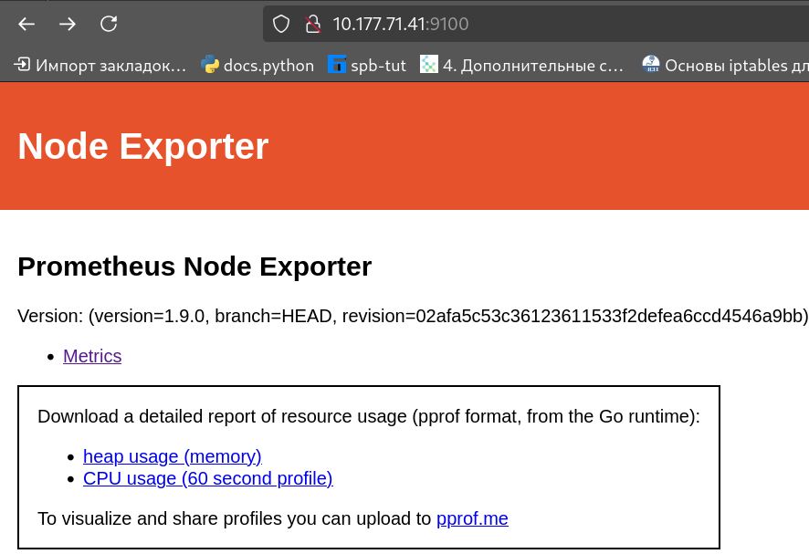
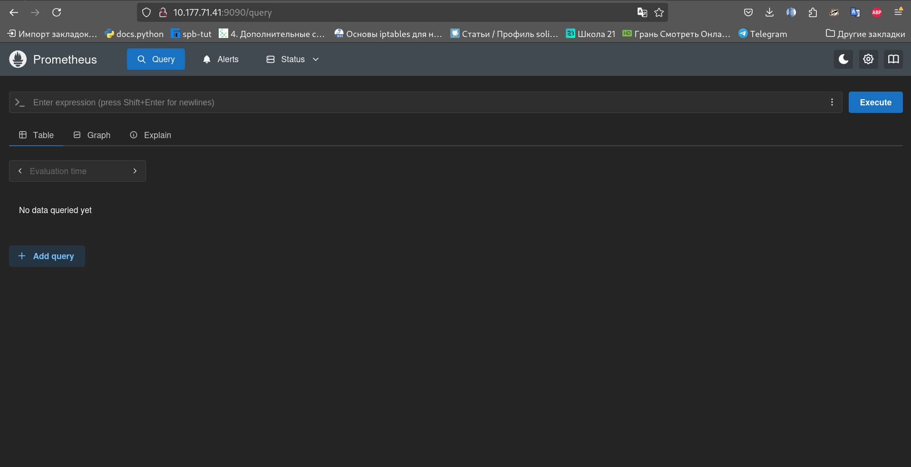
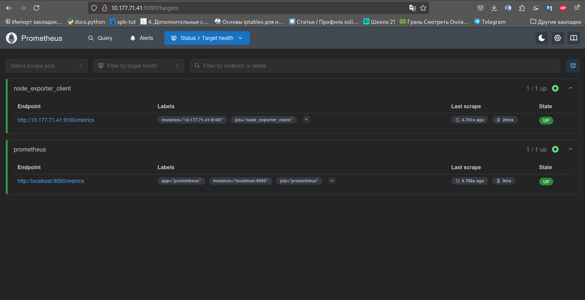
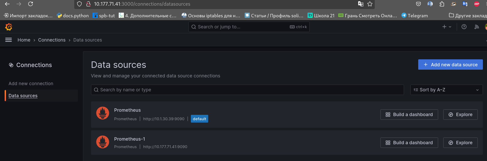
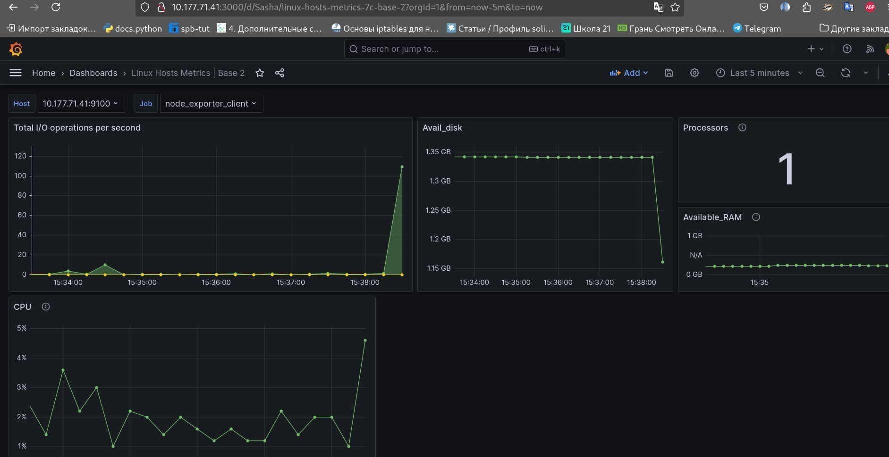
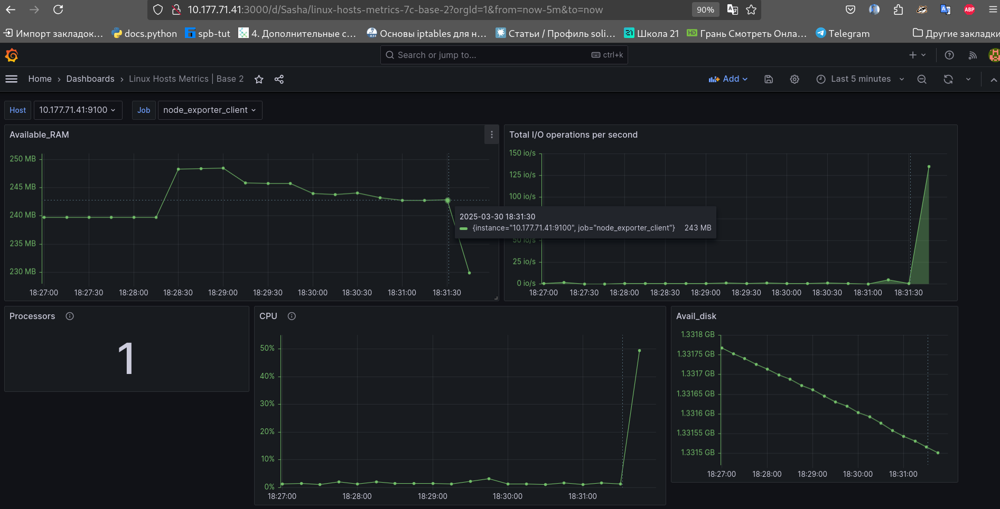

# Part 7. Prometheus и Grafana

-  Установка и запуск Node exporter

`Node exporter - это программа, которая собирает метрики со всей системы компьютера. Она
формирует отчёт и в режими реельного времени транслирует его с помощью веб-сервера, на нужный хост и порт 9100. Существуют и други такие же программы, которые имеют название агенты и они так же собирают информацию о процессах только уже из разных систем и даже других программ. Мониторят веб-серверы и кластеры`

-  Установка и запуск Prometheus

`Prometheus - это база данных временных рядов, которая собирает в себя информацию со множества агентов, таких как Node exporter, благодаря ей, мы можем корректно собирать и обрабатывать огроное количество различных метрик из разных систем.`

-  Подключение агента, к  Prometheus

-  Подключение Prometheus, к  Grafana

`Grafana - это сисетма визуализации разнообразных данных. С её помощью можно создовать глобальные системы мониторинга с удобным и наглядым визуалом и интерфейсом. Важно отметить, что Grafana сама ни как не достаёт данные, она только их принимает и визуализирует. Она, так же как и Prometheus является сервером, который вы запускаете у себя на хосте и куда вы направляете нужные потоки данных. Сейчас Grafana не даёт возможность установить последнюю версию в России, поэтому нужно найти либо более старую, либо использовать VPN`

-  Данные о системе в момент запуска скрипта-файловой помойки(02)

-  Рекакция системы на запуск стресс-теста
(stress -c 2 -i 1 -m 1 --vm-bytes 32M -t 10s)

